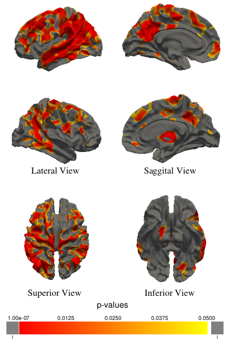

# Cortical Surface Analysis

Welcome to the Cortical Surface Analysis project! This repository contains code to analyze cortical surfaces, specifically sets of vertices and faces representing brain hemispheres. The primary focus is on extracting and analyzing cortical thickness and curvature information from brain reconstructions.

## Overview

Brain reconstructions consist of two meshes, each representing a hemisphere of the brain. The project places a significant emphasis on cortical thickness analysis, as well as curvature metrics. The analysis utilizes the FreeSurfer average template mapping to extract values from specific regions of interest. Additionally, the project allows for the application of masks generated through statistical experiments, enhancing the depth and specificity of the analysis. The surfaces can be generated through various 3D reconstruction algorithms using MRI pictures as an input. Nowadays, there are promising deep learning-based methods like CortexODE, Vox2Cortex, and DeepCSR, as well as traditional approaches such as the Computational Anatomy toolbox and FreeSurfer.

Please note that, as of now, defects within the cortical surfaces are not actively analyzed. This aspect may be considered for future development.

## Potential usage

The analysis holds the potential to facilitate group studies exploring how dementia impacts the human cortex through General Linear Modeling (GLM). An illustrative example is provided below:

## Features

- Analysis of cortical thickness and curvature
- Utilizes FreeSurfer's average template mapping
- Supports the application of experiment-generated masks
- Seamless extraction of values from regions of interest

## Getting Started

To get started with the Cortical Surface Analysis project, follow these steps:

1. Clone this repository to your local machine.
2. Install Pytorch3D which will require CUDA on your machine.
3. Explore the code and scripts, focusing on the modules relevant to cortical thickness and curvature analysis.
4. Integrate the code in your own data for analysis.
5. If you are interested in collaborating or using undisclosed features, feel free to contact me: `carl [at] winkler-sw.com`

Happy brain exploring!

